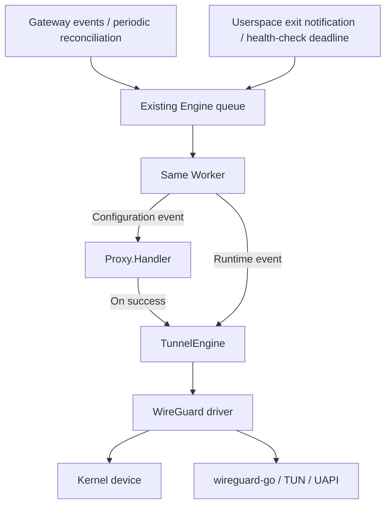

# Automatic WireGuard Userspace Fallback in Raven

## Objective

Address [issue #193](https://github.com/openyurtio/raven/issues/193): nodes that meet Raven's existing networking requirements but lack kernel WireGuard support should still be able to establish tunnels across node pools using the existing `wireguard` driver. The Agent automatically selects and manages `wireguard-go`, restores connectivity after a child process exits or its control interface fails, and releases resources when L3 is disabled.

This change includes kernel-first backend selection with automatic fallback, userspace process lifecycle management, recovery scheduling through the existing Engine, a bundled userspace backend, and a minimal VXLAN idempotency fix required for repeated reconciliation. Preserving existing public configuration and the behavior of kernel WireGuard, Libreswan, and the L7 Proxy is a compatibility requirement.

This document describes the objective, implementation, operating boundaries, and completed tests.

## Scope of Changes

| Location | Change and rationale |
| --- | --- |
| [Dockerfile](../Dockerfile) | Build and bundle `wireguard-go` at the version pinned by `go.mod/go.sum`, so fallback requires no additional container or separately managed daemon. |
| [WireGuard driver](../pkg/networkengine/vpndriver/wireguard/wireguard.go) and new device, process, and recovery implementations | Probe kernel support; manage TUN, UAPI, child processes, and resource ownership; handle health checks, backoff, and peer restoration. |
| [Optional lifecycle interface](../pkg/networkengine/vpndriver/driver.go), [runtime scheduling](../pkg/engine/runtime.go), [Engine](../pkg/engine/engine.go), and [TunnelEngine](../pkg/engine/tunnel.go) | Feed exit notifications and health-check deadlines into the existing queue; serialize reconciliation and shutdown cleanup; retain old driver instances only while userspace cleanup remains incomplete. |
| [VXLAN helper](../pkg/networkengine/routedriver/vxlan/utils.go) | Return the existing VXLAN device when its configuration is unchanged. Repeated `LinkAdd` calls previously returned `file exists`, blocking full network recovery after a userspace failure. Only this branch is fixed, with a stronger regression test. |
| Related Go tests and [automatic-fallback environment configuration](../hack/wireguard-fallback-cloud-init.yaml) | Verify backend selection, lifecycle management, shared Engine compatibility, and recovery with real networking. Forced backend selection remains a test-only facility. |

This change does not redesign Raven's dataplane or remove dependencies on VXLAN, TUN, routing, or netfilter. It adds no public backend-selection flag, Gateway field, Node label, CRD, or WireGuard metric. It does not modify Libreswan or the shared ipset implementation, extend VXLAN functionality, or address unrelated historical issues.

It does not promise key persistence across L3 toggles or Agent restarts, uninterrupted switching, WireGuard/IPsec interoperability, universal platform compatibility, or performance improvements. Streaming L7, platform matrices, scale, and long-duration stability testing require separate requirements and are not automatic extensions of this change.

## Backend Selection

Administrators continue to use `--vpn-driver=wireguard` or Helm's `vpn.driver=wireguard`. Libreswan remains the default VPN driver. No additional sidecar or DaemonSet, or CRD/yurt-manager upgrade, is required.

When VPN connections are needed, the driver attempts to create a real kernel WireGuard device:

| Creation result | Behavior |
| --- | --- |
| Success | Use the kernel backend and preserve existing configuration reconciliation and retries. |
| `EOPNOTSUPP` / `ENOTSUP` | Select userspace for the current driver instance; do not probe the kernel again during child-process recovery. |
| Insufficient permissions, invalid arguments, name conflicts, or other errors | Return the error and retain configuration retries without falling back. |
| Device creation succeeds but subsequent configuration fails | Return the configuration error without treating it as a lack of kernel support. |

Kernel support is not inferred from the kernel version, the presence of WireGuard tools in the image, or whether `wgctrl` opens successfully. Backend selection is retained only within the current driver instance.

## Userspace Lifecycle and Scheduling

The Agent starts the image's `/usr/local/bin/wireguard-go` on demand as a foreground child process, configures it through UAPI, and monitors its exit. It does not start a userspace process on ordinary nodes within a pool, while L3 is disabled, or when no peers are needed.

The WireGuard driver owns userspace failure detection, startup backoff, and the next reconciliation deadline. The Engine only queues and schedules work; it does not introduce a second recovery loop. Runtime events reconcile L3 directly and are not blocked by Proxy configuration errors. Ordinary configuration events retain the existing short-circuit behavior on Proxy errors, execution order, and bounded retries. Worker reconciliation and shutdown cleanup are mutually exclusive.

Userspace readiness waits and individual UAPI operations each have a 10-second timeout. Running devices are checked every five seconds, and startup failures use exponential backoff from one to 30 seconds. Ordinary configuration events cannot bypass startup backoff, and ordinary configuration errors do not increase it. Exit notifications and health scheduling still drive recovery when periodic reconciliation is disabled with `--sync-raven-rules=false`.

| Event | Driver instances, keys, and resources |
| --- | --- |
| Initialization | Create and initialize a new route driver, then create a new VPN driver; optionally inject lifecycle dependencies before calling VPN `Init()`. |
| VPN initialization failure | Preserve the existing rollback that cleans up only the initialized route driver. |
| Userspace child exit or UAPI failure | Withdraw failed VPN resources, reap the old process, and create a replacement within the current driver instance. Preserve the backend selection and in-memory key, and reapply the latest complete peer configuration. |
| L3 disabled, gateway role lost, or peers no longer needed | Stop the process and clean up the resources it owns. When disabling L3, clean up the VPN first and the route driver only after VPN cleanup succeeds. |
| Incomplete userspace cleanup | Retain resource ownership. `cleanupPending` prevents replacement drivers from being created until both VPN and route cleanup succeed. |
| L3 re-enabled | Create new route and VPN drivers, probe the backend again, and generate a new key. Do not reuse instances from the previous lifecycle. |

The optional `LifecycleAware` interface injects a Context and notification callback once before each new driver's first `Init()`. The callback only requests queued work, while `TunnelConfig` remains configuration-only. Libreswan does not need to implement the new interface, and kernel WireGuard does not enable the userspace runtime recovery policy.

Through the optional `CleanupContext` interface, userspace process-stop and UAPI-close waits share the remaining time in TunnelEngine's five-second cleanup polling budget. Cleanup sends SIGTERM first and escalates to SIGKILL when the grace period or remaining budget expires. If the process still cannot be reaped, cleanup retains ownership and returns an error; a replacement cannot start until a later cleanup attempt succeeds. This budget cannot preempt synchronous netlink/iptables calls and is not a hard limit on the total duration of all system operations. Linux parent-death signaling terminates the child if the Agent dies unexpectedly.

## Network Requirements and Compatibility

Userspace WireGuard replaces only the VPN device between gateways. Nodes still require:

- Linux network administration privileges, using the chart's existing hostNetwork/privileged deployment.
- VXLAN, IPv4 forwarding, routes and policy rules, and a correctly configured CNI.
- iptables/ipset, including the existing `hash:net` and `hash:net,net` types.
- A usable `/dev/net/tun` and writable `/var/run/wireguard` on userspace gateways.

Existing peer handling, public-key publication, VXLAN MTU calculation, VPN routing, NAT, and central-gateway forwarding are retained. Kernel/kernel, kernel/userspace, and userspace/userspace WireGuard combinations must interoperate. Libreswan uses IPsec and is not part of the WireGuard interoperability matrix.

Kernel peer replacement and the five-second relay keepalive retain their existing behavior. Only userspace uses incremental peer updates to avoid resetting sessions during periodic checks. Userspace relay keepalive is six seconds to avoid handshake retry conflicts when the bundled backend initiates handshakes simultaneously. The existing unit conversion for edge keepalive configuration is outside this change's scope.

L3 failures and disabling L3 alone must not stop the L7 Proxy. Restarting the entire Agent also restarts the proxy, so uninterrupted L7 service is not promised. Pod health probes and local configuration readiness do not establish that a remote handshake has succeeded; actual traffic across pools is needed to confirm connectivity.

## Usage, Upgrade, and Rollback

Upgrade to an image containing the userspace backend while retaining the existing `vpn.driver=wireguard` configuration and cluster credentials. Validate handshakes, traffic across pools, and recovery on both a kernel-capable gateway and a gateway requiring fallback before updating other pools according to the existing deployment strategy.

Disabling L3 through the existing `spec.tunnelConfig.Replicas: 0` setting causes the Agent to clean up tunnel resources. Re-enabling L3 creates new instances and keys. An Agent restart interrupts and rebuilds the tunnel. Rolling back to an older image removes userspace fallback; nodes without kernel WireGuard lose the corresponding L3 connectivity. Before rollback, arrange an available gateway or restore kernel support.

When troubleshooting, check the failure stage in the logs, TUN availability and permissions, occupied device or socket names, UDP reachability, and CNI/netfilter prerequisites. Permission errors must not be treated as successful automatic fallback.

## Completed Tests

The following tests were performed through September 20, 2026, covering automatic fallback, recovery and cleanup, compatibility, and image delivery. The primary environment was Ubuntu 24.04 arm64 with Linux 6.8; cluster tests used K3s and yurt-manager.

| Test | Coverage and result |
| --- | --- |
| Repository-wide unit tests | 16 test packages and 161 top-level tests passed, including six Libreswan subcases. Coverage includes backend selection, errors that must not trigger fallback, process lifecycle, UAPI timeouts, backoff, resource ownership, and Engine compatibility. |
| Concurrency and static checks | 75 top-level Engine/WireGuard tests passed under the Linux race detector with no data races reported; repository-wide vet checks passed. |
| VXLAN idempotency regression | Tests passed for reusing a device with unchanged configuration, creation, configuration changes, error paths, and actual Apply behavior. The `file exists` issue that blocked full network recovery was fixed. |
| Device and full-network integration | Kernel/kernel, kernel/userspace, userspace/userspace, and central-relay cases passed. All four full VXLAN/NAT cases passed in two consecutive runs, covering initial bidirectional Pod traffic, UDP source addresses, userspace process recovery, and existing cleanup assertions. |
| Real automatic fallback | Direct communication between two pools and central relay across three pools passed when the real kernel reported WireGuard as unsupported. Checks covered automatic userspace selection, process replacement, public-key preservation, traffic recovery, and resource cleanup. |
| Full Agent in a four-node cluster | KILL/SIGSTOP recovery, L3 disable/re-enable, strict Agent Pod restart checks, and explicit gateway role migration passed. Bidirectional ping and HTTP source-address checks succeeded after recovery. |
| L7 HTTP compatibility | All 91/91 sampled requests succeeded during L3 faults and toggles, and 22/22 during role migration. Whole-Agent restarts and rolling updates caused brief failures, followed by recovery. |
| Release image and Libreswan deployment | A linux/arm64 image built without cache from the repository Dockerfile passed entrypoint, dependency, and real two-node deployment checks. Validation covered kernel/userspace interoperability, automatic fallback, recovery, and real Libreswan IKE/Child SAs, bidirectional ESP traffic, L3 cleanup, and re-enablement. |

The three opt-in integration suites were not rerun as part of the final repository-wide/race regression. Network results above came from separate runs in dedicated environments. Full-network and four-node cluster tests used a test runtime, while the newly built release image was validated in a separate two-node deployment. These results do not constitute four-node full-network acceptance of the new release image. Cluster tests required CNI/forwarding and K3s CA adaptations and do not establish that the default configuration works without adaptation.

The VXLAN defect found during testing was fixed. Environment and test-script issues were corrected before successful reruns or follow-up checks. Libreswan still emitted the existing `ipset busy` cleanup warning, with cleanup completing on retry; that historical path was not changed. Validation does not cover a cross-platform matrix, streaming L7, performance, or long-duration stability, and does not promise uninterrupted service during Agent restarts. Additional validation should be triggered by relevant code changes, unresolved failures, or explicit support requirements.
